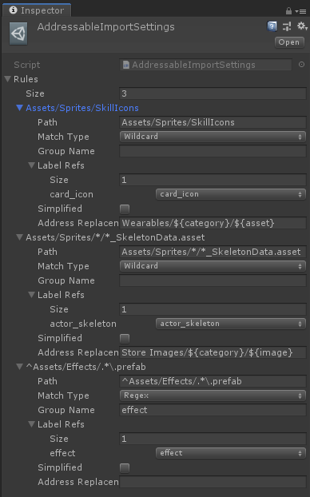

# Addressable Importer Usage

You should create a single AddressableImportSettings file located at `Assets/AddressableAssetsData/AddressableImportSettings.asset`. To create it, go to `Assets/AddressableAssetsData` folder, right click in your project window and choose `Create > Addressable Assets > Import Settings`.

Once the settings file selected, you can edit rules in the inspector window. Then click `File > Save Project` to apply the changes.

## Create a rule
- Path, the path pattern
- Match type
  - Wildcard, `*` matches any number of characters, `?` matches a single character
  - Regex
- Group name, leaves blank for the default group
- Labels, the labels to add
- Simplified, simplify address to filename without extension
- Address Replacement
  - When using Regex, this can be used to build the address based on information captured from the path.

## Rule Examples

| Type     | Example             |
|----------|---------------------|
| Wildcard | Asset/Sprites/Icons |
| Wildcard | Asset/Sprites/Level??/*.asset |
| Regex    | ^Assets/Models/.*\\.fbx |
| Regex    | Assets/Weapons/(?\<prefix\>(?\<category\>[^/]+)/(.*/)*)(?\<asset\>.*_Data.*\\.asset) |

## Address Replacement Example

Using this mode allows extraction of arbitrary information from the path, via the use of capture groups. Named capture groups can be referred to in `Address Replacement` via `${group}`. If groups are not named, they can be referred to numerically, via `$1`, `$2` and so on. For more information, refer to [Microsoft Docs - Substitutions in Regular Expressions](https://docs.microsoft.com/en-us/dotnet/standard/base-types/substitutions-in-regular-expressions).

## Notice for moved or re-imported assets
- The importer will not override existing labels.
- The importer will only override address if it looks like a path (starts with `Assets/`). In another word, if you changed or simplified the address, then reimport or move it, the address remains no change.
